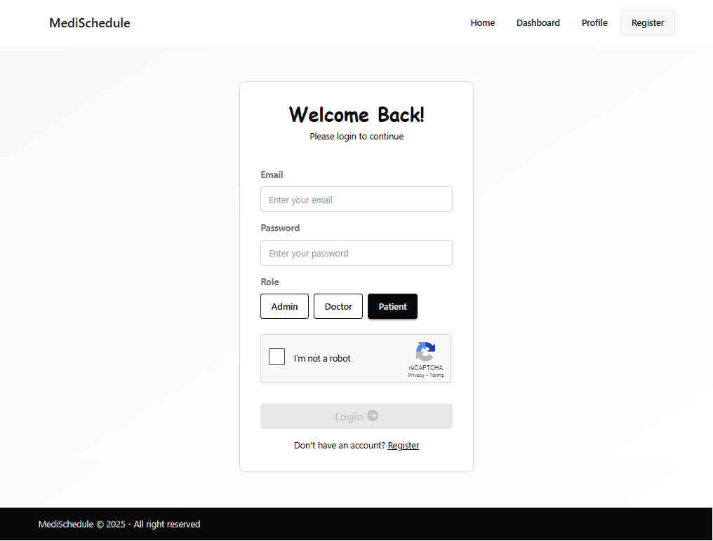
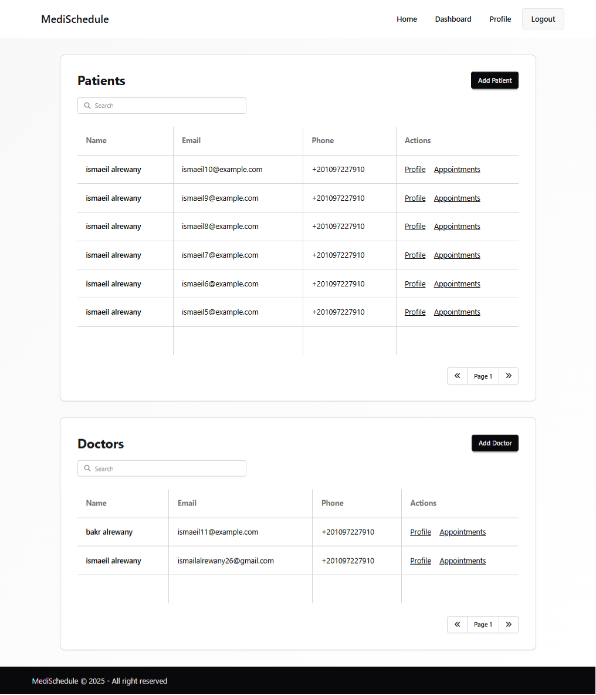
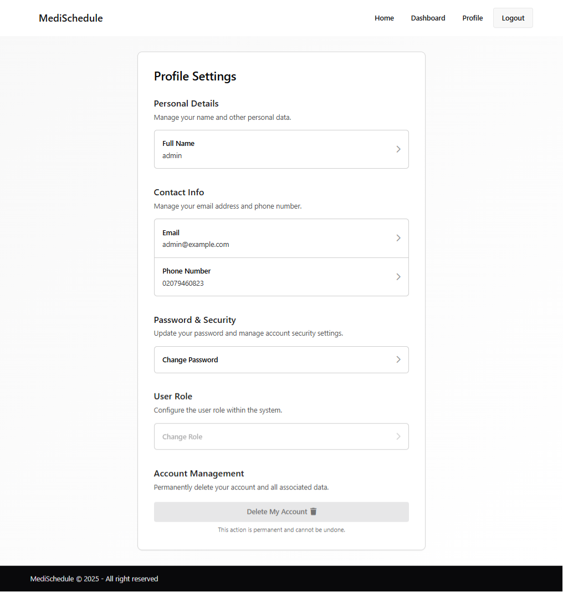
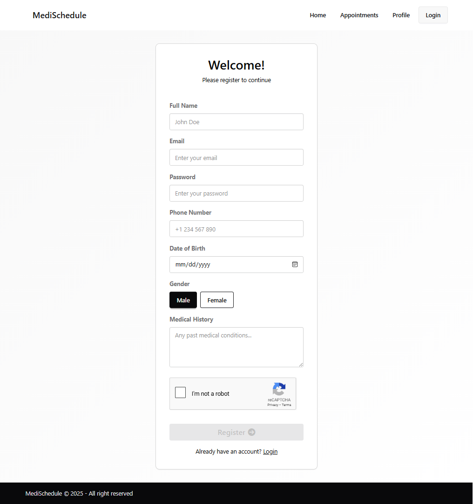

# MediSchedule - Medical Appointment Management System

<div align="center">
  
</div>

## Overview

MediSchedule is a comprehensive medical appointment management system that facilitates seamless interaction between patients, doctors, and administrators. Built with modern web technologies, it provides a robust platform for managing medical appointments with features like user authentication, appointment scheduling, availability management, and role-based access control.

## 🚀 Features

### For Patients
- **Patient Registration & Authentication** with reCAPTCHA verification
- **Appointment Booking** with available time slots
- **Appointment Management** (view, filter, and search appointments)
- **Profile Management** with medical history tracking
- **Responsive Interface** for all device types

### For Doctors
- **Doctor Registration & Authentication** with specialization details
- **Appointment Management** with patient information
- **Availability Scheduling** with customizable time slots
- **Profile Management** with qualifications and specializations
- **Patient Appointment History** access

### For Administrators
- **Admin Dashboard** with comprehensive overview
- **User Management** (patients and doctors)
- **Appointment Oversight** for all users
- **System Administration** capabilities
- **Advanced Filtering & Search** functionality

## 🛠️ Technology Stack

### Backend
- **Runtime**: Node.js
- **Framework**: Express.js
- **Database**: MongoDB with Mongoose ODM
- **Authentication**: JWT with HTTP-only cookies
- **Security**: bcryptjs for password hashing
- **Validation**: Validator.js
- **Environment**: dotenv for configuration

### Frontend
- **Framework**: React.js 19.0.0
- **Routing**: React Router DOM
- **Styling**: Tailwind CSS with DaisyUI
- **State Management**: React Hooks
- **Forms**: React Hook Form
- **HTTP Client**: Axios
- **Security**: Google reCAPTCHA

## 📁 Project Structure

```
medi-schedule/
├── backend/                    # Server-side application
│   ├── app/
│   │   ├── controllers/       # Business logic controllers
│   │   ├── database/          # Database models and connection
│   │   ├── middleware/        # Authentication and other middleware
│   │   ├── routes/           # API route definitions
│   │   ├── services/         # External services (reCAPTCHA)
│   │   └── utils/            # Utility functions
│   └── index.js              # Server entry point
├── frontend/                  # Client-side application
│   ├── src/
│   │   ├── components/       # Reusable UI components
│   │   ├── pages/           # Page components
│   │   ├── routes/          # Route configuration
│   │   ├── services/        # API service calls
│   │   └── layouts/         # Layout components
│   └── index.html           # HTML entry point
├── docs/                     # Documentation and assets
│   ├── images/              # Application screenshots
│   └── *.md                 # Documentation files
└── localssl/                # SSL certificates for local development
```

## 🔧 Installation & Setup

### Prerequisites
- Node.js (v16 or higher)
- MongoDB (local or cloud instance)
- Git

### Backend Setup
1. Navigate to backend directory:
   ```bash
   cd backend
   ```
2. Install dependencies:
   ```bash
   npm install
   ```
3. Create `.env` file (see [Environment Variables](#environment-variables))
4. Start development server:
   ```bash
   npm run dev
   ```

### Frontend Setup
1. Navigate to frontend directory:
   ```bash
   cd frontend
   ```
2. Install dependencies:
   ```bash
   npm install
   ```
3. Create `.env` file (see [Environment Variables](#environment-variables))
4. Start development server:
   ```bash
   npm run dev
   ```

## 🔐 Environment Variables

See the environment setup guides:
- [Backend Environment Setup](docs/backend-env.md)
- [Frontend Environment Setup](docs/frontend-env.md)

## 📚 API Documentation

Comprehensive API documentation is available:
- [API Endpoints](docs/api-endpoints.md)
- [Authentication](docs/authentication.md)
- [Database Schema](docs/database-schema.md)

## 🖥️ Application Screenshots

| Page | Screenshot |
|------|------------|
| **Homepage** |  |
| **Login** |  |
| **Dashboard** |  |
| **Appointments** |  |
| **Profile** |  |
| **Register** |  |

## 🚀 Deployment

### Backend Deployment (Vercel)
The backend is configured for Vercel deployment with `vercel.json`:
```json
{
  "version": 2,
  "builds": [{ "src": "index.js", "use": "@vercel/node" }],
  "routes": [{ "src": "/(.*)", "dest": "/index.js" }]
}
```

### Frontend Deployment (Netlify)
The frontend is configured for Netlify deployment with `netlify.toml`:
```toml
[build]
  command = "npm run build"
  publish = "dist"

[[redirects]]
  from = "/*"
  to = "/index.html"
  status = 200
```

## 🔒 Security Features

- **Password Hashing**: bcryptjs with salt rounds
- **JWT Authentication**: Secure token-based authentication
- **HTTP-only Cookies**: Prevents XSS attacks
- **CORS Configuration**: Controlled cross-origin requests
- **Input Validation**: Comprehensive data validation
- **reCAPTCHA Integration**: Bot protection for forms

## 📝 License

This project is licensed under the Apache License 2.0.

## 👨‍💻 Developer

**Ismaeil Alrewany**
- 📧 Email: [ismailalrewany332@gmail.com](mailto:ismailalrewany332@gmail.com)
- 📱 Phone: +201097227910
- 🐱 GitHub: [github.com/ismaeilalrewany](https://github.com/ismaeilalrewany)
- 💼 LinkedIn: [linkedin.com/in/ismaeil-alrewany](https://www.linkedin.com/in/ismaeil-alrewany/)
- 🫡 Qabilah: [qabilah.com/profile/ismaeil-alrewany](https://qabilah.com/profile/ismaeil-alrewany)
- 🌐 Portfolio: [ismaeilalrewany.tech](ismaeilalrewany.tech)

## 🔮 Future Enhancements

- Email/SMS notifications for appointments
- Real-time updates with WebSocket
- Payment integration
- Advanced reporting and analytics
- Mobile application
- Multi-language support
- Telemedicine integration

---

*For detailed documentation, please refer to the [docs](docs/) directory.*
